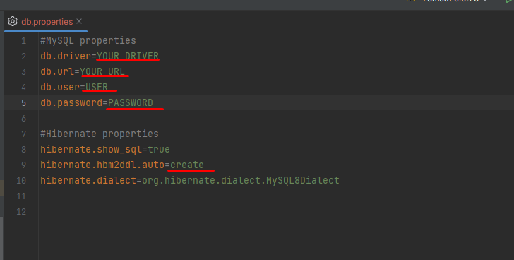

# 🎥 cinema-app 🎥
This project is a simulation of a simple cinema service that supports registration, authentication, and CRUD operations. It utilizes various Design Patterns, follows SOLID principles, and adheres to the REST structure of a WEB application.

## 📰 Database Schema

## 🌐 Functionality
* Register or login as a user
* Create, find, and add movies to movie sessions
* Create and find available movie sessions
* Create a shopping cart
* Complete an order
* Create and find movie sessions
* Create and add cinema halls to movie sessions
* Create and add tickets to the shopping cart

## ✨ Endpoint description (with roles and http-methods)
* GET: /cinema-halls - (user/admin)
* GET: /movies - (user/admin)
* GET: /movie-sessions/available - (user/admin)
* GET: /orders - (user)
* GET: /shopping-carts/by-user - (user)
* GET: /users/by-email - (admin)
* POST: /register - (all)
* POST: /cinema-halls - (admin)
* POST: /movies - (admin)
* POST: /movie-sessions - (admin)
* POST: /orders/complete - (user)
* PUT: /movie-sessions/{id} - (admin)
* PUT: /shopping-carts/movie-sessions - (user)
* DELETE: /movie-sessions/{id} - (admin)

## 💫 Technologies
* Java Core - 17 version
* Spring Context - 5.3.20 version
* Spring ORM - 5.3.20 version
* Spring WEB MVC - 5.3.20 version
* Spring Security - 5.6.10 version
* Hibernate - 5.6.14 version
* MySQL - 8.0.22 version
* Jackson Databind - 2.14.1 version

## 🏃 How to run app
1. Clone the repository from GitHub
2. Create an empty database
3. Set up Database connectivity 
in src/main/resources/db.properties file 
with your own URL, username, password and JDBC driver

4. Configure Tomcat server
   * Edit Configuration
   * 
   * Add New Configuration
   * 
   * Tomcat Server
   * Local
   * 
   * Setup deployment configurations
   * 
   * 

5. Run and enjoy the program! 
An admin user with login: "admin@gmail.com" 
and password: "admin123" is already provided 
for authentication and authorization.
